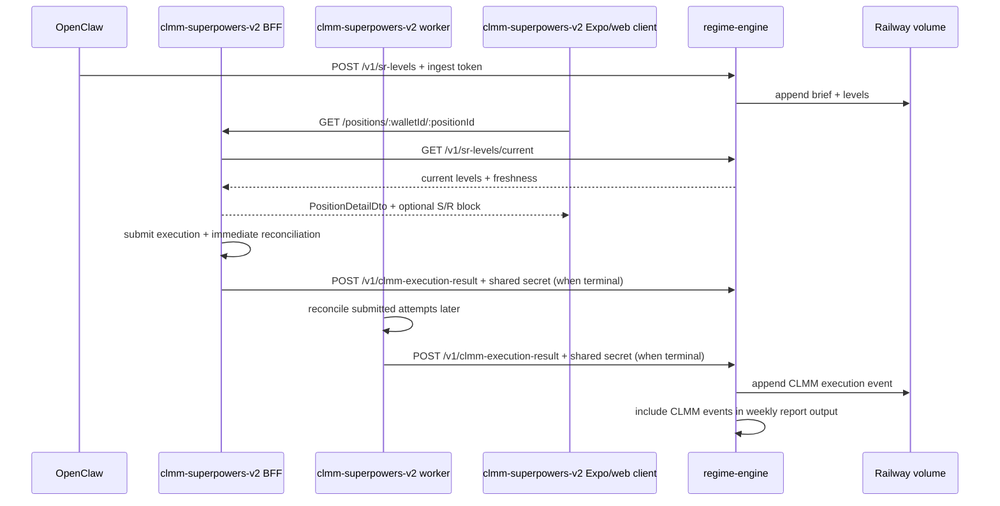
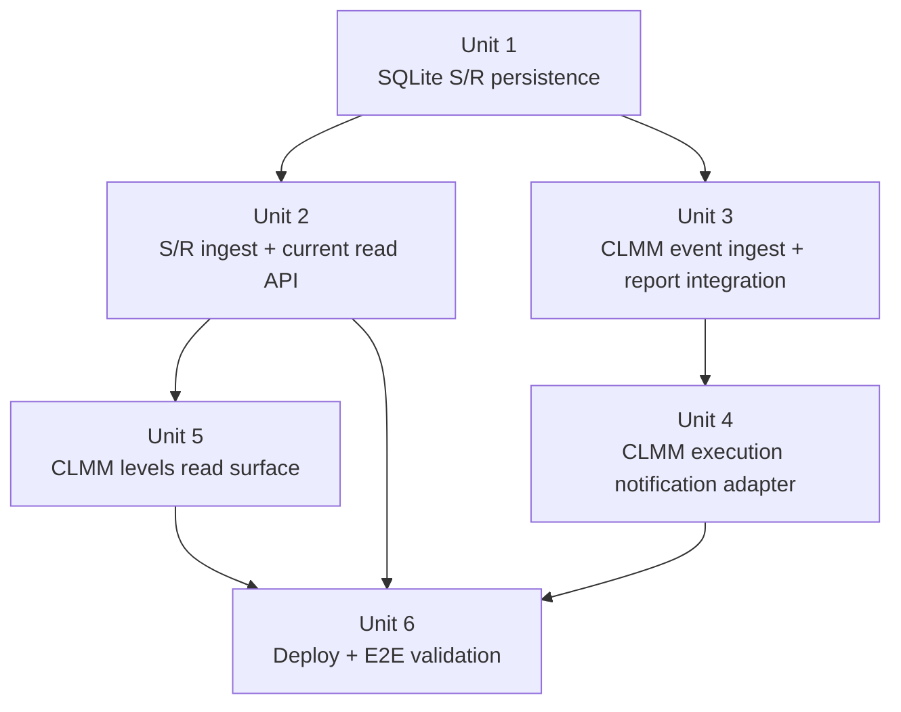

# feat: Integrate CLMM with regime engine ledger and S/R reads

## Overview

This plan closes the integration gap between `regime-engine` and the CLMM app repo `clmm-superpowers-v2` without expanding either repo beyond the sprint boundaries in the origin document. The implementation keeps `regime-engine` as an analytics service, adds durable S/R ingestion and current-level reads, adds a CLMM-facing execution-event ingest path that does not depend on `/v1/plan`, and deploys the service on Railway using storage and networking choices that match the codebase as it exists today.

**Target repos:** `regime-engine`, `clmm-superpowers-v2`

## Problem Frame

The origin requirements define three missing loops: OpenClaw briefs are not durably stored, CLMM execution outcomes do not flow back into a truthful analytics ledger, and the two services are not deployed together in a way that supports a constrained live run (see origin: `docs/brainstorms/2026-04-17-clmm-regime-engine-integration-requirements.md`).

Local research changed the technical shape of the plan in two important ways:

- `regime-engine` is currently a small Fastify service backed by local SQLite in `src/ledger/schema.sql` and `src/ledger/store.ts`, not a Postgres/Drizzle service.
- `clmm-superpowers-v2` already has a real Nest BFF, worker runtime, Expo shell, and `packages/ui` screen layer, so the integration should land in the existing BFF, worker, DTO, and UI seams rather than inventing a new shell/runtime path.

## Requirements Trace

- R1. Persist OpenClaw-derived S/R levels durably by symbol and source.
- R2. Expose one current active S/R set while preserving history.
- R3. Provide a read path for current `SOL/USDC` levels from source `mco`.
- R4. Surface current levels read-only in CLMM with freshness and safe empty-state behavior.
- R5. Send a CLMM execution-result event to `regime-engine` after execution is recorded.
- R6. Keep regime-engine notification best-effort and non-blocking for the execution path.
- R7. Record enough execution context to support truthful analytics and later reporting.
- R8. Make replay of the same CLMM execution event idempotent.
- R9. Deploy both services into one Railway project with working service-to-service connectivity.
- R10. Expose only the minimum public capabilities needed for this sprint.
- R11. Protect write endpoints with simple shared-secret controls appropriate to the sprint.
- R12. Support one manual end-to-end validation flow across ingestion, reads, execution posting, and duplicate handling.
- R13. Preserve the path to one live $100 SOL/USDC position after integration verification.

## Scope Boundaries

- `POST /v1/plan` remains out of scope for CLMM runtime behavior.
- No runtime regime filter is added to CLMM exit logic.
- No dashboard, charting, historical S/R comparison UI, or report-tuning project is added.
- No multi-analyst support is added beyond source `mco`.
- No shared library is extracted between `regime-engine` and `clmm-superpowers-v2`.
- No generalized pool-to-regime symbol mapping is added beyond the sprint’s fixed `SOL/USDC` read path.
- No platform migration away from Railway is included.
- No capital ramp beyond $100 is included.

## Context & Research

### Relevant Code and Patterns

- `src/http/routes.ts` wires a small set of thin Fastify handlers against a single `LedgerStore`; new endpoints should follow the same adapter pattern.
- `src/ledger/schema.sql`, `src/ledger/store.ts`, and `src/ledger/writer.ts` establish the current persistence style: SQLite, canonical JSON payload storage, explicit transaction boundaries, and append-only ledger semantics where possible.
- `src/http/__tests__/executionResult.e2e.test.ts` and `src/http/__tests__/routes.contract.test.ts` show the expected route-contract and end-to-end testing style in `regime-engine`.
- `src/report/weekly.ts` reads JSON payloads directly from SQLite tables, which makes additive reporting straightforward if new event families are kept in separate tables.
- `src/server.ts`, `.env.example`, and `Dockerfile` show current runtime assumptions: configurable host/port and a relative SQLite path under `tmp/`.
- `README.md`, `AGENTS.md`, and `docs/architecture/repo-map.md` in `clmm-superpowers-v2` confirm the real repo boundaries: `apps/app` is Expo shell only, `packages/ui` owns screens, and `packages/adapters` owns HTTP/job integrations.
- `packages/adapters/src/inbound/http/PositionController.ts` already serves the `/positions` BFF surface and is the natural seam for enriching position detail with current S/R levels.
- `apps/app/src/api/positions.ts` and `apps/app/src/api/positions.test.ts` show all client reads already flow through `EXPO_PUBLIC_BFF_BASE_URL`; the app should not call `regime-engine` directly.
- `packages/application/src/dto/index.ts`, `packages/ui/src/view-models/PositionDetailViewModel.ts`, and `packages/ui/src/screens/PositionDetailScreen.tsx` are the existing shared-contract and UI seams for additive S/R presentation.
- `packages/adapters/src/inbound/http/ExecutionController.ts` already performs immediate submission and immediate reconciliation inline, making it the first authoritative seam for posting terminal execution outcomes.
- `packages/application/src/use-cases/execution/ReconcileExecutionAttempt.ts` and `packages/adapters/src/inbound/jobs/ReconciliationJobHandler.ts` are the later reconciliation seam when an attempt remains `submitted`.
- `packages/adapters/src/composition/AdaptersModule.ts`, `packages/adapters/src/inbound/http/AppModule.ts`, `packages/adapters/src/inbound/http/tokens.ts`, and `packages/adapters/src/inbound/jobs/tokens.ts` show the current Nest provider wiring pattern for new outbound adapters.
- `packages/adapters/.env.sample` and `apps/app/.env.example` already split backend-only env from app-public env, so regime-engine configuration should remain backend-only in the CLMM repo.

### Institutional Learnings

- `docs/solutions/` is not present in this repo, so there are no stored institutional learnings to incorporate.

### External References

- Railway Volumes docs confirm persistent app data should be stored on an attached volume and mounted at the exact in-container path the app writes to, such as `/app/tmp` for `tmp/ledger.sqlite`.
- Railway Private Networking docs confirm private service URLs use `http`, require an internal hostname plus port, and recommend dual-stack binding on `::` for compatibility with both legacy and newer environments.
- Railway Domains docs confirm browser traffic cannot use the private network and must go through a public domain, which matters for keeping CLMM clients on the existing public BFF surface rather than trying to reach `railway.internal` from Expo/web code.
- Railway Variables docs confirm reference variables can point at another service’s Railway-provided variables, which is the safest way to distribute public/private regime-engine base URLs in a shared project.

## Key Technical Decisions

| Decision                                | Choice                                                                                                                   | Rationale                                                                                                                                                                                                                                |
| --------------------------------------- | ------------------------------------------------------------------------------------------------------------------------ | ---------------------------------------------------------------------------------------------------------------------------------------------------------------------------------------------------------------------------------------- |
| Persistence backend for `regime-engine` | Keep SQLite and attach a Railway volume                                                                                  | This preserves the current architecture in `README.md` and `architecture.md`, avoids an unnecessary Postgres/Drizzle migration, and still gives durable storage in production.                                                           |
| S/R history model                       | Use append-only brief metadata plus level rows                                                                           | Latest-brief reads satisfy “current active set” without mutating historical rows, which fits the repo’s determinism and auditability bias better than a `superseded_at` update model.                                                    |
| CLMM execution ingest strategy          | Preserve existing plan-linked `POST /v1/execution-result` and add a CLMM-specific ingest endpoint/table                  | Reusing the current endpoint would require fake or shadow `planId`/`planHash` linkage and would fight the explicit “do not use `/v1/plan`” boundary from the origin.                                                                     |
| Write-endpoint protection               | Use explicit shared-secret headers for OpenClaw and CLMM writes                                                          | Once `regime-engine` has a public domain for browser and ingest traffic, app-level request guards are more reliable than relying on undocumented network-origin heuristics.                                                              |
| Railway runtime binding                 | Prefer `HOST=::` in deployment configuration                                                                             | Railway’s current private-network docs recommend dual-stack binding for compatibility across environment generations.                                                                                                                    |
| CLMM levels consumption path            | Keep Expo/web clients on the existing BFF (`EXPO_PUBLIC_BFF_BASE_URL`) and have the BFF read `regime-engine` server-side | This preserves repo boundaries, avoids direct client coupling to `regime-engine`, and keeps Railway public/private base URL choices backend-only.                                                                                        |
| CLMM notification wiring                | Post regime-engine execution events from `packages/adapters` at the authoritative HTTP/job seams                         | `ExecutionController` and `ReconciliationJobHandler` already own the timing of persisted execution-state transitions, so adapter-layer notification is lower-risk than introducing a new cross-service application port for this sprint. |

## Open Questions

### Resolved During Planning

- Should S/R persistence introduce Postgres/Drizzle? No. The sprint should extend the existing SQLite ledger and attach a Railway volume instead.
- Should CLMM adapt to the existing plan-linked execution-result contract? No. The sprint should add a separate CLMM-specific execution ingest path and keep the plan-linked contract unchanged.
- Should “current S/R set” be tracked by mutating prior rows? No. The sprint should derive “current” from the latest ingested brief per `(symbol, source)` and keep the data append-only.
- Should internal-only writes rely solely on `railway.internal` reachability? No. The sprint should still require a shared-secret header for CLMM write calls because the service also needs a public domain.
- Should the CLMM client fetch regime-engine levels directly? No. The existing BFF position-detail path should remain the only client-visible integration surface.
- Should this sprint introduce generic pool-to-symbol mapping inside CLMM? No. The sprint can use the fixed `SOL/USDC` plus `mco` read path and defer broader mapping work.

### Deferred to Implementation

- Exact CLMM payload field names should match the repo’s actual DTO vocabulary once the outbound port is added; the plan fixes the required semantics, not the exact interface names.
- The exact Markdown/JSON shape for any additive weekly-report section can be finalized during implementation as long as it remains additive and does not break existing consumers.
- The exact provider-token placement for the new regime-engine adapters can be finalized during implementation as long as the wiring stays inside `packages/adapters` and respects the existing HTTP vs worker composition roots.

## Alternative Approaches Considered

- Promote `regime-engine` to a Postgres/Drizzle service.
  Rejected because it introduces an architectural migration unrelated to the sprint’s stated value and conflicts with the current local-first SQLite design.
- Force CLMM to call `POST /v1/plan` to obtain `planId`/`planHash` before posting execution results.
  Rejected because it violates the origin scope boundary and creates fake analytical linkage between execution exits and a plan the runtime is not actually using.
- Overload the existing `POST /v1/execution-result` route with a union payload.
  Rejected because it complicates the existing stable contract and error behavior when a separate CLMM-specific endpoint keeps the blast radius smaller.

## High-Level Technical Design

> _This illustrates the intended approach and is directional guidance for review, not implementation specification. The implementing agent should treat it as context, not code to reproduce._

## Implementation Units

- [ ] **Unit 1: Extend the SQLite ledger for append-only S/R storage**

**Goal:** Add durable S/R storage to `regime-engine` without replacing the service’s current SQLite persistence model.

**Requirements:** R1, R2, R9

**Dependencies:** None

**Target repo:** `regime-engine`

**Files:**

- Modify: `src/ledger/schema.sql`
- Create: `src/ledger/srLevels.ts`
- Modify: `src/ledger/store.ts`
- Test: `src/ledger/__tests__/srLevels.test.ts`

**Approach:**

- Add an append-only `sr_level_briefs` table keyed by `(source, brief_id)` for brief metadata and a child `sr_levels` table keyed to the brief record for individual levels.
- Keep “current active set” as a query concern by selecting the latest ingested brief per `(symbol, source)` rather than mutating historical rows.
- Reuse `runInTransaction` from `src/ledger/store.ts` so brief insertion and child-level insertion commit atomically.
- Keep the existing plan/execution ledger tables unchanged.
- Preserve local development defaults by keeping the SQLite file under `tmp/`, then rely on Railway volume mounting at `/app/tmp` in deployment.

**Execution note:** Start with a failing ledger test that inserts two briefs for the same `(symbol, source)` and proves the latest-brief query leaves history intact.

**Patterns to follow:**

- `src/ledger/writer.ts`
- `src/ledger/store.ts`
- `src/ledger/__tests__/ledger.test.ts`

**Test scenarios:**

- Happy path: inserting a brief with multiple levels stores one brief row and all level rows in a single transaction.
- Happy path: querying current levels after two briefs for the same `(symbol, source)` returns only the latest brief’s levels.
- Edge case: querying current levels for an unknown `(symbol, source)` returns no active brief.
- Error path: inserting the same `(source, brief_id)` twice returns an idempotent result without writing duplicate rows.
- Integration: if level-row insertion fails after brief insertion begins, the transaction rolls back and no partial brief remains.

**Verification:**

- The schema can store multiple historical briefs for `SOL/USDC` and derive the latest active set without updating prior rows.
- Existing plan/execution ledger tests continue to model the same table set plus the new S/R tables.

- [ ] **Unit 2: Add regime-engine S/R ingest and current-read HTTP surfaces**

**Goal:** Expose a canonical S/R ingest API for OpenClaw and a current-levels read API for CLMM/operator consumption.

**Requirements:** R1, R2, R3, R4, R10, R11

**Dependencies:** Unit 1

**Target repo:** `regime-engine`

**Files:**

- Modify: `src/contract/v1/types.ts`
- Modify: `src/contract/v1/validation.ts`
- Create: `src/http/auth.ts`
- Create: `src/http/handlers/srLevelsIngest.ts`
- Create: `src/http/handlers/srLevelsCurrent.ts`
- Modify: `src/http/routes.ts`
- Modify: `src/http/openapi.ts`
- Test: `src/http/__tests__/srLevels.e2e.test.ts`
- Modify: `src/http/__tests__/routes.contract.test.ts`

**Approach:**

- Add a canonical `POST /v1/sr-levels` contract in `src/contract/v1` with strict validation and an idempotent duplicate-brief response.
- Require an OpenClaw shared-secret header at the handler boundary using a small reusable auth helper rather than inline env checks in each route.
- Add `GET /v1/sr-levels/current` that reads the latest brief for the requested `(symbol, source)` and returns a read-optimized payload with `capturedAt` and grouped levels.
- Keep response semantics simple: `404` when no current brief exists, `400` for malformed input, `401` for invalid ingest token.
- Update OpenAPI and route-contract tests so the new endpoints become part of the documented service shape.

**Execution note:** Start with a failing route-level e2e test for the happy path and duplicate-ingest behavior before implementing the handlers.

**Patterns to follow:**

- `src/http/handlers/executionResult.ts`
- `src/http/handlers/report.ts`
- `src/http/__tests__/executionResult.e2e.test.ts`
- `src/http/errors.ts`

**Test scenarios:**

- Happy path: valid `POST /v1/sr-levels` with the correct token persists a brief and returns inserted counts.
- Happy path: `GET /v1/sr-levels/current?symbol=SOL/USDC&source=mco` returns the latest brief metadata and ordered levels.
- Edge case: omitted `source` defaults to `mco` only if that choice is made explicitly in implementation; otherwise the endpoint rejects missing `source`.
- Edge case: empty `levels` array is rejected as invalid input.
- Error path: missing or incorrect ingest token returns `401` without touching storage.
- Error path: malformed request payload returns canonical validation errors from `src/http/errors.ts`.
- Integration: posting the same brief twice produces an idempotent response and does not replace the active set with duplicates.
- Integration: posting a newer brief changes the current-read response while preserving the older brief in history.

**Verification:**

- OpenClaw can post a canonical brief payload into `regime-engine`.
- CLMM’s BFF can read current levels through a configured regime-engine base URL, while public/manual reads remain possible through the service domain when needed.

- [ ] **Unit 3: Add a CLMM-specific execution ingest path and weekly-report integration**

**Goal:** Let CLMM append execution events to the regime-engine truth data without relying on plan linkage or modifying the existing plan-linked execution-result contract.

**Requirements:** R5, R6, R7, R8, R10, R11, R12

**Dependencies:** Unit 1

**Target repo:** `regime-engine`

**Files:**

- Modify: `src/ledger/schema.sql`
- Create: `src/ledger/clmmExecutionEvents.ts`
- Modify: `src/contract/v1/types.ts`
- Modify: `src/contract/v1/validation.ts`
- Create: `src/http/handlers/clmmExecutionResult.ts`
- Modify: `src/http/routes.ts`
- Modify: `src/http/openapi.ts`
- Modify: `src/report/weekly.ts`
- Test: `src/ledger/__tests__/clmmExecutionEvents.test.ts`
- Test: `src/http/__tests__/clmmExecutionResult.e2e.test.ts`
- Modify: `src/report/__tests__/weeklyReport.snapshot.test.ts`
- Modify: `src/http/__tests__/routes.contract.test.ts`

**Approach:**

- Add a new append-only table for CLMM execution events keyed by a CLMM-provided correlation ID with canonical JSON payload storage and conflict detection for mismatched replays.
- Introduce `POST /v1/clmm-execution-result` as a separate internal contract that records CLMM execution outcomes and keeps the existing `POST /v1/execution-result` untouched for plan-linked flows.
- Require a separate shared-secret header for this endpoint because the service will still have a public domain for browser reads and OpenClaw writes.
- Carry the minimum event fields required by the origin doc: correlation ID, trigger/position context, breach direction, timing, transaction reference, exit asset posture, and execution status. Allow additive optional cost fields when CLMM can provide them.
- Keep weekly-report changes additive by introducing a CLMM-specific execution summary section rather than overloading the existing plan-linked `execution` summary semantics.

**Execution note:** Implement new contract behavior test-first and keep the current `/v1/execution-result` tests unchanged to prove backward compatibility.

**Patterns to follow:**

- `src/ledger/writer.ts`
- `src/http/handlers/executionResult.ts`
- `src/http/__tests__/executionResult.e2e.test.ts`
- `src/report/weekly.ts`

**Test scenarios:**

- Happy path: valid CLMM execution event with the correct internal token writes one event row and returns a success acknowledgement.
- Happy path: weekly report output includes additive CLMM execution counts when such events exist in the selected window.
- Edge case: replaying the same correlation ID with byte-identical payload returns idempotent success.
- Error path: replaying the same correlation ID with a different payload returns conflict rather than silently overwriting history.
- Error path: missing or invalid internal token returns `401`.
- Error path: malformed payload returns canonical validation errors.
- Integration: existing plan-linked `/v1/execution-result` tests still pass unchanged after the new route is added.
- Integration: weekly-report generation still works when there are only legacy plan-linked execution results, only CLMM execution events, or both.

**Verification:**

- `regime-engine` can accept CLMM execution notifications without requiring `planId` or `planHash`.
- Weekly reports remain deterministic and additive rather than silently changing the meaning of existing fields.

- [ ] **Unit 4: Add a regime-engine execution-event adapter at CLMM’s authoritative execution seams**

**Goal:** Make CLMM post best-effort execution notifications to `regime-engine` from the HTTP and worker seams that already own authoritative execution-state transitions.

**Requirements:** R5, R6, R7, R8, R9, R12

**Dependencies:** Unit 3

**Target repo:** `clmm-superpowers-v2`

**Files:**

- Create: `packages/adapters/src/outbound/regime-engine/RegimeEngineExecutionEventAdapter.ts`
- Test: `packages/adapters/src/outbound/regime-engine/RegimeEngineExecutionEventAdapter.test.ts`
- Modify: `packages/adapters/src/composition/AdaptersModule.ts`
- Modify: `packages/adapters/src/inbound/http/AppModule.ts`
- Modify: `packages/adapters/src/inbound/http/tokens.ts`
- Modify: `packages/adapters/src/inbound/jobs/tokens.ts`
- Modify: `packages/adapters/src/inbound/http/ExecutionController.ts`
- Modify: `packages/adapters/src/inbound/http/ExecutionController.test.ts`
- Modify: `packages/adapters/src/inbound/jobs/ReconciliationJobHandler.ts`
- Modify: `packages/adapters/src/inbound/jobs/ReconciliationJobHandler.test.ts`

**Approach:**

- Implement a dedicated outbound adapter under `packages/adapters/src/outbound/regime-engine/` that posts the CLMM-specific execution payload to `POST /v1/clmm-execution-result`, using `attemptId` as the idempotency key/correlation ID.
- Inject the adapter into the BFF and worker composition roots, but keep the behavior in `packages/adapters`; this sprint does not need a new application-layer port for analytics notification.
- In `ExecutionController.ts`, invoke the adapter only after CLMM has already persisted the authoritative attempt state and appended the local lifecycle event for immediate terminal outcomes (`confirmed`, `partial`, or `failed`).
- In `ReconciliationJobHandler.ts`, invoke the adapter only after `reconcileExecutionAttempt` has already persisted a terminal state for attempts that stayed `submitted` after the initial HTTP request.
- Treat regime-engine notification as best-effort: use bounded retry inside the adapter if useful, then log and swallow final failure so outbound analytics transport never changes CLMM execution authority.
- Use no-op behavior when the regime-engine base URL or shared secret is absent, preserving local development ergonomics.

**Execution note:** Start with failing controller/job-handler tests that prove notification timing, then add the outbound adapter and DI wiring.

**Patterns to follow:**

- `packages/adapters/src/inbound/http/ExecutionController.ts`
- `packages/adapters/src/inbound/http/ExecutionController.test.ts`
- `packages/application/src/use-cases/execution/ReconcileExecutionAttempt.ts`
- `packages/adapters/src/inbound/jobs/ReconciliationJobHandler.ts`
- `packages/adapters/src/composition/AdaptersModule.ts`

**Test scenarios:**

- Happy path: an immediate terminal submission path posts one regime-engine event after CLMM has saved the updated attempt and appended the local lifecycle event.
- Happy path: the outbound payload includes `attemptId`, position/trigger context, breach direction, terminal result, transaction references, and post-exit posture.
- Happy path: a later worker reconciliation posts one regime-engine event when a previously `submitted` attempt reaches a terminal state.
- Edge case: an immediate `pending` result does not post anything until worker reconciliation reaches a terminal state.
- Edge case: missing regime-engine configuration chooses the no-op adapter and leaves the execution flow successful.
- Error path: a transient `5xx` response triggers bounded retries and eventually succeeds without changing the HTTP or worker result.
- Error path: repeated adapter failure is logged but does not change the returned execution result or cause reconciliation rollback.
- Integration: call-order assertions show the outbound notification happens after internal persistence, not before submission or reconciliation.
- Integration: replaying the same `attemptId` is safe because `regime-engine` treats the CLMM event endpoint as idempotent.

**Verification:**

- CLMM can notify `regime-engine` without blocking execution success or introducing direct client coupling.
- The application layer remains unchanged for this integration; only the adapter/runtime layer knows how to call `regime-engine`.

- [ ] **Unit 5: Enrich CLMM position detail with current S/R levels through the existing BFF and UI path**

**Goal:** Make current regime-engine levels available in CLMM’s existing position-detail surface without bypassing the BFF or violating the repo’s `apps/app` vs `packages/ui` boundaries.

**Requirements:** R3, R4, R9, R10, R12

**Dependencies:** Unit 2

**Target repo:** `clmm-superpowers-v2`

**Files:**

- Modify: `packages/application/src/dto/index.ts`
- Create: `packages/adapters/src/outbound/regime-engine/CurrentSrLevelsAdapter.ts`
- Test: `packages/adapters/src/outbound/regime-engine/CurrentSrLevelsAdapter.test.ts`
- Modify: `packages/adapters/src/inbound/http/AppModule.ts`
- Modify: `packages/adapters/src/inbound/http/tokens.ts`
- Modify: `packages/adapters/src/inbound/http/PositionController.ts`
- Modify: `packages/adapters/src/inbound/http/PositionController.test.ts`
- Modify: `apps/app/src/api/positions.ts`
- Modify: `apps/app/src/api/positions.test.ts`
- Modify: `packages/ui/src/view-models/PositionDetailViewModel.ts`
- Modify: `packages/ui/src/screens/PositionDetailScreen.tsx`
- Modify: `packages/ui/src/screens/PositionDetailScreen.test.tsx`

**Approach:**

- Extend `PositionDetailDto` with an optional S/R block that carries grouped support/resistance levels plus freshness metadata, keeping the DTO additive and compatible with existing consumers.
- Implement a server-side `CurrentSrLevelsAdapter` in `packages/adapters` and have `PositionController.ts` enrich the existing position-detail response rather than introducing a parallel client API path.
- Keep the CLMM client contract unchanged at the transport layer: `apps/app/src/api/positions.ts` continues to call the BFF via `EXPO_PUBLIC_BFF_BASE_URL`, then validates the additive DTO shape.
- Treat S/R enrichment as non-fatal. If `regime-engine` returns `404` or is temporarily unavailable, return the normal position detail payload with the S/R block omitted so the UI can render an honest empty state.
- Keep the sprint scoped to the fixed `SOL/USDC` plus `mco` read path instead of inventing generalized pool-to-symbol mapping during this integration.
- Update `packages/ui` to render grouped levels and freshness when present and a clear “no regime levels available” state when absent, while leaving the Expo route host thin.

**Execution note:** Start with failing controller and API-parser tests for populated vs omitted S/R data, then update the UI rendering once the DTO contract is fixed.

**Patterns to follow:**

- `packages/adapters/src/inbound/http/PositionController.ts`
- `apps/app/src/api/positions.ts`
- `packages/application/src/dto/index.ts`
- `packages/ui/src/view-models/PositionDetailViewModel.ts`
- `packages/ui/src/screens/PositionDetailScreen.tsx`

**Test scenarios:**

- Happy path: `PositionController.ts` returns the existing position detail plus populated S/R data when `regime-engine` has current `SOL/USDC` levels.
- Happy path: the app API parser accepts the enriched DTO and the UI renders grouped support/resistance levels plus freshness.
- Edge case: a `404` or empty current-level response from `regime-engine` produces a position detail response with no S/R block and a stable empty state in the UI.
- Error path: transient regime-engine failures do not fail the whole position-detail read; they degrade by omitting S/R data.
- Integration: the app still reads only from `EXPO_PUBLIC_BFF_BASE_URL`; no app-public regime-engine env var is introduced.
- Integration: position-detail tests continue to pass for both pre-existing trigger data and additive S/R data.

**Verification:**

- CLMM exposes regime-engine levels through the BFF it already owns rather than through a new direct client integration.
- The existing position-detail UI can show freshness and a non-crashing empty state without changing the Expo route structure.

- [ ] **Unit 6: Deploy on Railway, document the contract, and run one manual integrated validation**

**Goal:** Make the integration operable in a shared Railway project and capture the minimum deployment/documentation work needed to support the sprint outcome.

**Requirements:** R9, R10, R11, R12, R13

**Dependencies:** Units 2, 4, and 5

**Target repos:** `regime-engine`, `clmm-superpowers-v2`

**Files:**

- `regime-engine`
  - Modify: `.env.example`
  - Modify: `src/server.ts`
  - Modify: `README.md`
  - Modify: `architecture.md`
  - Modify: `Dockerfile`
  - Modify: `docs/2026-04-17-clmm-regime-engine-integration-sprint.md`
  - Test: `src/__tests__/smoke.test.ts`
- `clmm-superpowers-v2`
  - Modify: `README.md`
  - Modify: `packages/adapters/.env.sample`
  - Modify: `apps/app/.env.example`

**Approach:**

- Document the new env vars explicitly:
  - `OPENCLAW_INGEST_TOKEN`
  - `CLMM_INTERNAL_TOKEN`
  - `LEDGER_DB_PATH`
  - `REGIME_ENGINE_BASE_URL` in `clmm-superpowers-v2` backend env
  - `REGIME_ENGINE_INTERNAL_TOKEN` in `clmm-superpowers-v2` backend env
  - `EXPO_PUBLIC_BFF_BASE_URL` remains the only app-public URL in `clmm-superpowers-v2`
- Update deployment defaults so Railway can mount a volume at `/app/tmp` and the app binds to `::` in deployment configuration while remaining locally runnable.
- Use Railway reference variables so CLMM backend runtimes receive the correct server-side `REGIME_ENGINE_BASE_URL` for the shared project, while Expo/web clients continue to use the existing public BFF domain.
- Keep the manual integrated validation intentionally small: seed S/R levels, confirm the BFF-enriched position-detail read, trigger one breach-driven execution path, observe one CLMM event in `regime-engine`, and confirm idempotent replay behavior.
- Reflect the resolved architecture changes back into the draft sprint doc so the next execution session does not revert to the original Postgres/Drizzle and plan-linked assumptions.

**Execution note:** Test expectation: none -- this unit is primarily deployment wiring and documentation, but smoke coverage should be updated anywhere defaults or route bootstrapping changed.

**Patterns to follow:**

- `.env.example`
- `README.md`
- `Dockerfile`
- `src/server.ts`

**Test scenarios:**

- Happy path: local and container runtime defaults still boot the service with the new environment variables documented.
- Edge case: volume-backed `LEDGER_DB_PATH` remains a valid relative path when the volume is mounted at `/app/tmp`.
- Error path: missing shared-secret env vars fail closed for write endpoints rather than silently disabling auth.
- Integration: a Railway deployment can keep Expo/web clients on the public BFF domain while backend runtimes use server-side regime-engine base URLs.

**Verification:**

- The deployment story matches Railway’s current volume and private-network behavior rather than the original draft’s Postgres assumptions.
- Both repos document the same contract names, env vars, and route expectations.

## System-Wide Impact

- **Interaction graph:** OpenClaw writes into `regime-engine`; CLMM BFF reads current S/R data from `regime-engine`; CLMM BFF and worker write execution outcomes into `regime-engine`; weekly report generation reads both legacy plan-linked execution results and the new CLMM execution-event table.
- **Error propagation:** OpenClaw and CLMM write endpoints fail closed on auth and validation, but CLMM’s outbound notification adapter swallows final transport failures after retry so on-chain execution remains authoritative.
- **State lifecycle risks:** S/R data must remain append-only by brief to avoid “current-set” drift; CLMM execution events need correlation-ID conflict handling to prevent silent double counting; Railway volume mounting must match the SQLite path exactly or the ledger will appear to work while persisting nowhere durable.
- **API surface parity:** Existing `/v1/execution-result` behavior must remain unchanged while the new S/R and CLMM-specific routes are added; OpenAPI and README must document the new routes consistently.
- **Integration coverage:** Unit tests alone will not prove Railway public/private base URL wiring, BFF-mediated read behavior, or cross-repo shared-secret coordination; the manual E2E validation in Unit 6 is required.
- **Unchanged invariants:** `regime-engine` still does not execute trades, `clmm-superpowers-v2` still owns execution truth, and no shared library is introduced between repos.

## Phased Delivery

### Phase 1

- Units 1-3 in `regime-engine`
- Outcome: durable S/R storage, S/R HTTP surface, CLMM execution ingest surface, and report compatibility

### Phase 2

- Units 4-5 in `clmm-superpowers-v2`
- Outcome: outbound execution notifications and position-detail S/R reads wired through the existing BFF, worker, DTO, and UI boundaries

### Phase 3

- Unit 6 across both repos
- Outcome: Railway-ready configuration, aligned docs, and one manual integrated validation run

## Risks & Dependencies

| Risk                                                                                                                          | Mitigation                                                                                                                                                            |
| ----------------------------------------------------------------------------------------------------------------------------- | --------------------------------------------------------------------------------------------------------------------------------------------------------------------- |
| The sprint draft’s Postgres/Drizzle assumptions leak back into implementation.                                                | Keep SQLite as an explicit planning decision, update the draft doc in Unit 6, and anchor persistence work to `src/ledger/schema.sql` and `src/ledger/store.ts`.       |
| CLMM lacks enough authoritative execution context at notification time to build the outbound payload cleanly.                 | Build the adapter payload from stored attempt, preview, and history context at the authoritative HTTP/job seams instead of re-deriving business logic in the adapter. |
| Railway private networking works, but the public domain still exposes internal write routes.                                  | Require app-level shared-secret headers for all write routes instead of assuming network-origin filtering.                                                            |
| The CLMM repo’s existing boundary split could be violated by direct client fetches or by moving screen logic into `apps/app`. | Keep transport in the BFF/API layer, shared shape in `packages/application` DTOs, and rendering in `packages/ui`, leaving Expo routes thin.                           |
| Weekly-report consumers rely on current fields.                                                                               | Make CLMM execution reporting additive rather than reinterpreting the existing `execution` summary shape.                                                             |

## Documentation / Operational Notes

- Update `README.md`, `architecture.md`, and `.env.example` in `regime-engine` so they no longer imply “no secrets required” once shared-secret ingress is added.
- Document the Railway volume mount requirement explicitly: `LEDGER_DB_PATH` must point inside the mounted path used for persistence.
- Document `REGIME_ENGINE_BASE_URL` and `REGIME_ENGINE_INTERNAL_TOKEN` as backend-only CLMM config in `packages/adapters/.env.sample`, while keeping `apps/app/.env.example` limited to `EXPO_PUBLIC_BFF_BASE_URL`.
- Keep the manual E2E scenario lightweight and intentional; this sprint does not justify CI automation for the cross-repo deploy path.

## Sources & References

- **Origin document:** `docs/brainstorms/2026-04-17-clmm-regime-engine-integration-requirements.md`
- Secondary design draft: `docs/2026-04-17-clmm-regime-engine-integration-sprint.md`
- Related code: `src/ledger/schema.sql`
- Related code: `src/http/routes.ts`
- Related code: `src/http/__tests__/executionResult.e2e.test.ts`
- Related code: `packages/adapters/src/inbound/http/PositionController.ts`
- Related code: `packages/adapters/src/inbound/http/ExecutionController.ts`
- Related code: `packages/adapters/src/inbound/jobs/ReconciliationJobHandler.ts`
- Related code: `packages/application/src/dto/index.ts`
- Related code: `apps/app/src/api/positions.ts`
- Related code: `packages/ui/src/screens/PositionDetailScreen.tsx`
- External docs: `https://docs.railway.com/volumes`
- External docs: `https://docs.railway.com/private-networking`
- External docs: `https://docs.railway.com/networking/domains/working-with-domains`
- External docs: `https://docs.railway.com/public-networking`
- External docs: `https://docs.railway.com/variables/reference`
